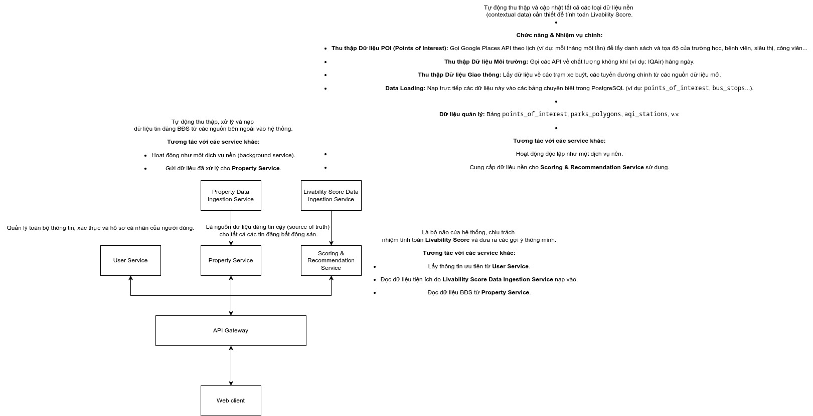

# Smart Real Estate Platform: Backend & Livability Engine

## Executive Summary

This repository hosts the backend microservices ecosystem for the **Smart Real Estate Platform**, a graduation thesis project designed to revolutionize property searching.

Unlike traditional platforms that focus solely on price and area, this system introduces a proprietary **"Livability Score Engine."** This engine aggregates multi-dimensional geospatial data to objectively quantify the quality of life for any given location, aiding users in making informed decisions based on safety, convenience, education, and future potential.

---

## Scientific Methodology & Data Integrity

To ensure the system's reliability and academic rigor, we address core challenges regarding data sourcing, weighting logic, and user-generated content quality.

### 1\. The Factor Framework (Urban Planning Standards)

The components of the Livability Score are not arbitrary. They are derived from established urban planning frameworks such as the **"15-Minute City" concept** and the **OECD Better Life Index**.

- **Core Pillars:** Safety, Healthcare, Education, Mobility (Transportation), Environment, and Convenience.

### 2\. Weight Determination (The Hedonic Pricing Model)

We moved beyond subjective manual weighting. The system employs a **Data-Driven Approach** using Machine Learning:

- **Model:** We utilize **XGBoost** to perform regression analysis on property prices against surrounding amenities (Hedonic Pricing).
- **Explainability:** Using **SHAP (SHapley Additive exPlanations)**, we extract the "Feature Importance" of each amenity category.
- **Logic:** If the model detects that "Proximity to Parks" significantly increases property value in a specific district, the "Environment" factor automatically receives a higher weight for that zone.

### 3\. Data Quality Assurance (Anti-Fraud & Price Validation)

Since the platform allows user-generated listings, we implement a **Statistical Anomaly Detection** pipeline to prevent "virtual prices" (fake pricing) from corrupting the training dataset:

1.  **Ground Truth Establishment:** We maintain a `market_price_trends` table derived from thousands of verified crawled listings (Mogi.vn).
2.  **Z-Score Analysis:** When a user submits a property, the system calculates the Z-Score of their requested price against the local average.
3.  **Outlier Filtering:** Listings with prices deviating significantly (e.g., \> ±2 Standard Deviations) are flagged as "Unverified Outliers" and are **excluded** from the model retraining pipeline to maintain data purity.

### 4\. Architecture

